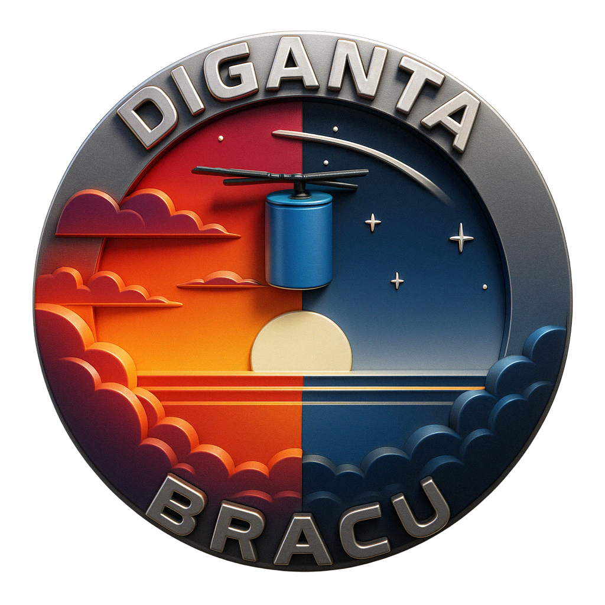

# BRACU Diganta



## About

BRACU Diganta is a pioneering student organization at BRAC University dedicated to innovation, research, and technological advancement. Our team works on cutting-edge projects in robotics, artificial intelligence, and sustainable technology solutions.

## Website Overview

This repository contains the official website for BRACU Diganta, showcasing our:
- Mission and vision
- Team achievements
- Project gallery
- Contact information

## Features

- **Modern Cosmic Theme**: Space-inspired design with animated elements
- **Responsive Layout**: Fully mobile-friendly design
- **Interactive Elements**: Includes animations and interactive components
- **Contact Form**: Allow visitors to get in touch
- **Project Showcase**: Gallery section to highlight our work
- **Achievement Tracking**: Display of team accomplishments

## Technologies Used

- HTML5
- CSS3
- JavaScript
- Font Awesome for icons
- Google Fonts
- Responsive design principles

## Getting Started

### Prerequisites

- A modern web browser
- Basic understanding of HTML/CSS/JS for any modifications

### Installation

1. Clone the repository
   ```
   git clone https://github.com/zamanlabs/Bracu-Diganta.git
   ```

2. Open `index.html` in your web browser to view the website

## Project Structure

- `index.html` - Main HTML file
- `styles.css` - CSS styling
- `script.js` - JavaScript functionality
- `images/` - Contains all website images including logos

## Contributing

Interested in contributing? Please contact the BRACU Diganta team at diganta@bracu.ac.bd.

## Contact

- **Email**: diganta@bracu.ac.bd
- **Location**: BRAC University, Mohakhali, Dhaka, Bangladesh
- **Phone**: +880 2 9844051

## License

© 2023 BRACU Diganta. All Rights Reserved. 